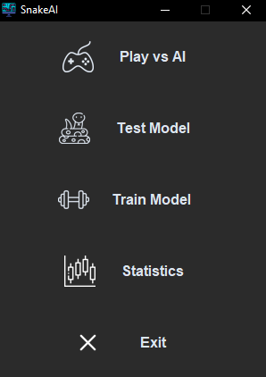

# SnakeAI
SnakeAI is a package developed to provide an interactive tool for training neural networks in mastering the Snake game, using a genetic algorithm for the training.

The main functionality is:

- Play against one of the trained models
- Observe a model playing while showing the neural network responding to inputs
- Train new models by selecting the neural network architecture and configuration, as well as the genetic algorithm
- Generate statistics over the different trained models and compare them graphically
 

## Main menu
Once the app is started it will prompt the main manu, the different options correspond to those described above.
 
 

  <picture>
    <source media="(prefers-color-scheme: dark)" srcset="./readme_resources/main_menu.png">
    
  </picture>

  

## Play vs AI
Under this section we can play against one of the trained models, as well as configure some of the game setting as graphics interface, speed, grid size..

https://github.com/laguneroo/SnakeAI/assets/129681739/1d25c24f-3924-43c3-a830-b9662670b3cc

 

## Test Model
In this section we can test our trained models and see the strongest activations over the neural network. During this execution the app produces son statistical data about the model that can be used to be compared with other models.

https://github.com/laguneroo/SnakeAI/assets/129681739/6405decc-d97f-45d0-9b55-1c6d864660ec

 

## Train Model Config
Previous to lauch a model traning we will be prompted with a configuration window consisting in three tabs:

- General
- Neural Network
- Genetic Algorithm

 

https://github.com/alvarott/SnakeAI/assets/129681739/88b15aaf-9d77-438f-b2db-34351da71600

 

### General
Under this tab we will configure general settings:

 - **Model name          :** Model's name
 - **Game size           :** Grid size
 - **Cpu cores           :** Logic cpu's cores to use during training
 - **Vision              :** Numeric representation of distances to feed the model (binary or real)
 - **Previous population :** This option unlocks the possibility of selecting an existing population and continue its training, during every iteration of the training the best individual(model) and the current population it is saved to disk under the path **<installation_folder>/SnakeAI_data/**

### Neural Network
The next parameters of a dense neural network are configurable:

- **Hidden layers :**  List of comma separated integer values (index = layer, value = number of nodes)(e.i [40, 40] two layers of 40 nodes each)
- **Hidden initialization :** Hidden layers initilization function
- **Hidden activation :** Hidden layers activation function
- **Output initilization :** Output layer initialization function
- **Output activation :** Output layer activation function
- **Bias :** Include bias vector
- **Bias initialization :** Bias vector initialization

### Genetic Algorithm
The app implements a classic genetic algorithm, the following parameters are configurable:

- **Population :** Number of individuals
- **Selection :** Selection method during evolution process
- **Crossover:** Crossover method (specific parameters of the method are also configurable i.e crossover_rate)
- **Mutation:** Mutation method (currently just Gaussian implemented)
- **Replacement:** Population replacement method

 

## Train Model
During the training we can monitor the advance of the process with data represented over plots as population average score, population average fitness among others. It is also possible to stop the training and check how the model is performing launching the game.

 

https://github.com/alvarott/SnakeAI/assets/129681739/a0543962-2e1a-4fdf-985d-a0715f85ae6f

 

## Dependencies
This project make use of the following third-party libraries:

- Numpy
- Matplotlib
- Pygame
- Customtkinter
 

